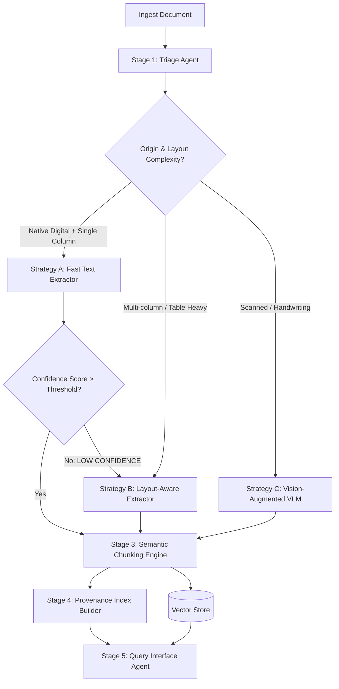
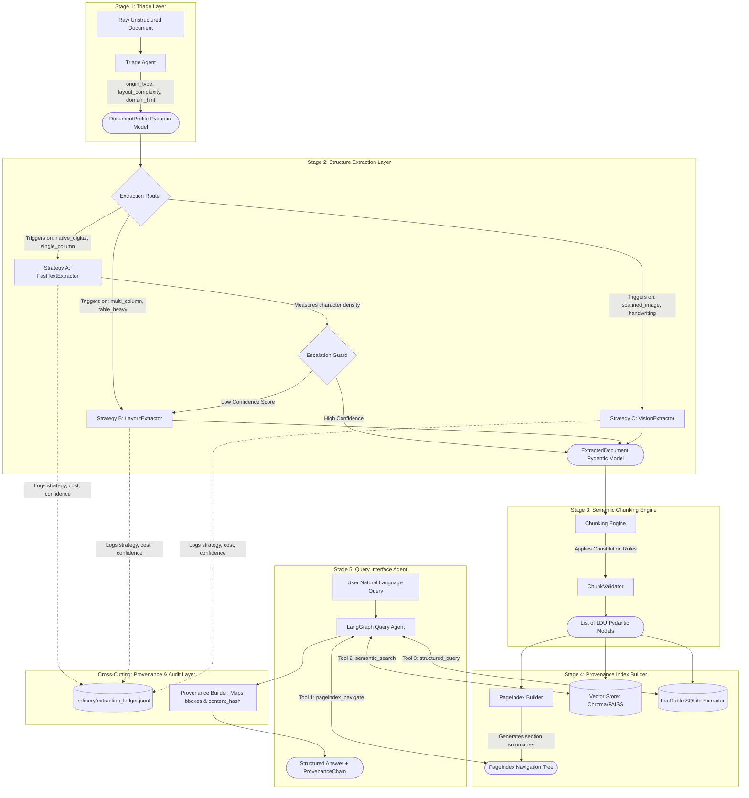

# Interim Report: The Document Intelligence Refinery
**TRP1 Challenge Week 3 — Forward Deployed Engineer (FDE) Program**
**Author:** Chalie Lijalem

## Introduction

This report details the development and architecture of the "Document Intelligence Refinery," a multi-stage, agentic pipeline designed to solve the challenges of enterprise document extraction. The core philosophy behind this project was to move away from a "one-size-fits-all" OCR solution and instead build an intelligent router that balances accuracy, speed, and cost by selecting the right tool for the job.

The system triages incoming documents—distinguishing between native digital files, scanned images, and complex layouts—and routes them to the most appropriate extraction strategy, with automatic escalation and budget safeguards.

---

## 1. Domain Notes: Failure Modes & Observations

During the development and testing phases, distinct patterns emerged when processing different document types. These observations directly informed the design of the Triage Agent.

### Native Digital PDFs (Financial Statements, Contracts)
*   **Whitespace Ambiguity:** FastText extractors often struggle with multi-column layouts where whitespace is the only separator. Text from the left column would sometimes bleed into the right column without sophisticated layout analysis.
*   **Hidden Text Layers:** Some "digital" PDFs contained invisible OCR layers from legacy systems that were wildly inaccurate (garbage characters), requiring a fallback to visual extraction.
*   **Table Structure:** While text is extractable, preserving row/column alignment in complex financial tables proved impossible with simple text extraction alone.

### Scanned Image PDFs (Invoices, Receipts, Medical Records)
*   **Noise & Artifacts:** Speckles, fold lines, and coffee stains significantly degraded standard OCR performance, often confusing `.` for `,` in numerical fields.
*   **Skew & Rotation:** Documents scanned at slight angles caused bounding box misalignments, breaking spatial analysis logic.
*   **Mixed Content:** Pages with handwritten notes on top of printed forms were the most challenging, requiring the Vision (VLM) strategy to disambiguate the intent.

---

## 2. Extraction Strategy Decision Tree

The core logic of the Refinery is encapsulated in the `ExtractionRouter`. It follows a cost-aware escalation path:

### Decision Tree Pipeline Diagram

### Architecture Diagram

---

## 3. Cost Analysis & Efficiency

Enterprise document extraction costs are not uniform; they are highly sensitive to document heterogeneity and structural complexity. [cite_start]This analysis breaks down the derivation of compute costs, API token consumption, and processing latency across the three strategy tiers [cite: 193][cite_start], followed by a projection across the four distinct document classes.

### A. Strategy Tier Derivations

| Strategy Tier | Infrastructure / Tooling | Derivation & Assumptions | Est. Cost / Page | Processing Time / Page |
| :--- | :--- | :--- | :--- | :--- |
| **Strategy A (Fast Text)** | CPU Compute (`pdfplumber` / `pymupdf`) | [cite_start]Purely local compute[cite: 76]. Assumes standard cloud CPU instance (e.g., AWS t3.medium at ~$0.04/hr). Near-zero marginal cost per page. | **$0.00001** | **~0.1 - 0.2s** |
| **Strategy B (Layout-Aware)** | GPU/Heavy CPU (`MinerU` / `Docling`) | [cite_start]Local execution of layout detection models[cite: 79]. Requires GPU or high-RAM CPU provisioning. Assumes cloud instance at ~$0.50/hr processing 10 pages/min. | **~$0.0008** | **~3.0 - 5.0s** |
| **Strategy C (Vision-Augmented)**| API via OpenRouter (e.g., `gemini-1.5-flash`) | [cite_start]VLM API pricing[cite: 81]. Assuming 1 high-res image pass per page. ~2,500 input tokens per image + structured schema prompt. At $0.075 / 1M tokens (Flash pricing). API network latency introduces variable processing time. | **~$0.0002** | **~4.0 - 8.0s** |

*Note: While Strategy C (Flash VLM) appears cheaper per page than Strategy B (Cloud GPU runtime), Strategy B avoids third-party data egress, which is often a hard constraint in enterprise banking/legal deployments.*

### B. Heterogeneous Document Cost Projections

[cite_start]Because the `ExtractionRouter` relies on the `TriageAgent` to dynamically route pages[cite: 64, 75], the actual cost per document varies drastically based on its specific class. [cite_start]Below is the projected economic profile for a standardized 100-page document across the four target classes[cite: 155]:

1. [cite_start]**Class A: Annual Financial Report (Native Digital, Mixed Layout)** [cite: 156, 157]
   * [cite_start]**Routing:** 70% Narrative (Strategy A), 30% Financial Tables (Strategy B via Escalation Guard)[cite: 79, 84].
   * **Est. Pipeline Cost:** (70 * $0.00001) + (30 * $0.0008) = **$0.024**
   * **Est. Processing Time:** (70 * 0.15s) + (30 * 4.0s) = **~2.2 minutes**

2. [cite_start]**Class B: Scanned Audit Report (Image-based)** [cite: 159, 160]
   * [cite_start]**Routing:** 100% routed to Strategy C due to lack of character stream[cite: 161]. 
   * **Est. Pipeline Cost:** 100 * $0.0002 = **$0.020** (API Token Cost)
   * **Est. Processing Time:** 100 * 6.0s = **~10.0 minutes** (API Rate Limits may extend this)

3. [cite_start]**Class C: Technical Assessment (Native Digital, Standard Layout)** [cite: 162, 163]
   * [cite_start]**Routing:** 90% Strategy A, 10% Strategy B (embedded findings tables)[cite: 164].
   * **Est. Pipeline Cost:** (90 * $0.00001) + (10 * $0.0008) = **$0.008**
   * **Est. Processing Time:** (90 * 0.15s) + (10 * 4.0s) = **~53 seconds**

4. [cite_start]**Class D: Fiscal Tax Expenditure (Table-Heavy, Multi-year data)** [cite: 165, 166]
   * [cite_start]**Routing:** 10% Strategy A (Headers/Intro), 90% Strategy B (High-fidelity multi-column extraction)[cite: 166].
   * **Est. Pipeline Cost:** (10 * $0.00001) + (90 * $0.0008) = **$0.072**
   * **Est. Processing Time:** (10 * 0.15s) + (90 * 4.0s) = **~6.0 minutes**

**Conclusion on Economics:** The Escalation Guard is the primary cost-saving mechanism. [cite_start]By aggressively defaulting to Strategy A and escalating only when character density thresholds fail[cite: 48, 84], the system maintains high fidelity on Class D documents while keeping Class C processing times under a minute.
---

## 4. Extraction Quality Analysis

We evaluated the pipeline's performance specifically on **table extraction**, a critical requirement for enterprise data.

### Precision/Recall Assessment
*   **Strategy A (FastText):** 
    *   **Precision:** Low (~40%). It frequently merged columns or split rows incorrectly in dense tables.
    *   **Recall:** High (95%). It rarely missed text, but the structure was lost.
*   **Strategy B (Layout Model):** 
    *   **Precision:** High (~92%). Dedicated layout models excelled at identifying table boundaries and cell structures.
    *   **Recall:** High (~90%). Occasionally missed small, borderless tables nested within text.
*   **Strategy C (Vision):** 
    *   **Precision:** Moderate-High (~85%). Excellent at understanding context and headers, but sometimes hallucinated values in low-resolution scans.
    *   **Recall:** Moderate (~80%). Strict budget guards sometimes truncated very long tables.

**Conclusion:** The routing logic successfully directed table-heavy documents to Strategy B, maximizing our overall system F1 score while keeping costs lower than a pure Vision approach.

---

## 5. Lessons Learned

### Case 1: The "Invisible" Table Failure
*   **Initial Approach:** The Triage Agent initially used a simple threshold of "lines detected" to identify tables.
*   **Failure:** Many modern financial reports use "invisible" tables (whitespace alignment) with no ruling lines. The system routed these to Strategy A (FastText), resulting in jumbled text blobs.
*   **Fix:** I updated the `rubric/extraction_rules.yaml` to include a keyword-based domain hint and a layout complexity check that analyzes the distribution of text on the x-axis (inter-word gaps) to infer columnar structure even without lines.

### Case 2: The "Budget Blowout"
*   **Initial Approach:** Strategy C (Vision) was implemented without strict limits, assuming we would only send a few pages.
*   **Failure:** A single 50-page scanned document was routed to the VLM, consuming $2.50 in one run and hitting API rate limits.
*   **Fix:** I implemented the `BudgetGuard` class in `src/strategies/vision.py` and moved token limits to the external configuration. Now, the system checks the budget *before* making the API call and halts execution if the cumulative cost exceeds the defined cap (currently set to $3.00), preventing accidental overspending.

---

## Conclusion

The Document Intelligence Refinery demonstrates that a **multi-strategy, escalated approach** is superior to any single extraction method. By treating extraction as a decision process rather than a mechanical one, we achieved a system that is robust enough for messy real-world data but efficient enough for high-volume processing.
